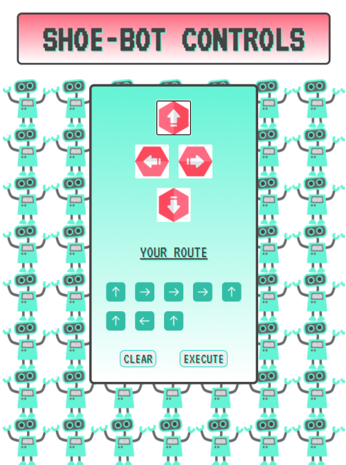

# ShoeBot

###### May 2020

_I made this app in order to control a little robot my partner built (out of an old shoe- hence the name!). It can go forwards, backwards, left and right!_

### Main learning points:

- I was able to practice using fetch() again but instead of using a get request like I had for the Kayne West Quote Generator, I used a post request (because I wanted to send data to ShoeBot).
- The user selects the directions by clicking on the relevant image button. This data is then stored in a JavaScript object which is later stringified before being sent to ShoeBot.
- I learnt about JSON.stringify: When sending data to a web server, the data has to be a string. JSON.stringify() converts a JavaScript object into a JSON string. If you wanted to convert data back again after receiving it you would use JSON.parse().
- I used the DOM appendChild to make the users chosen directions show underneath the controls by inserting the arrow image that they clicked on into a div container. This was good practice as I'd not done this much before and I was really pleased with how it worked.
