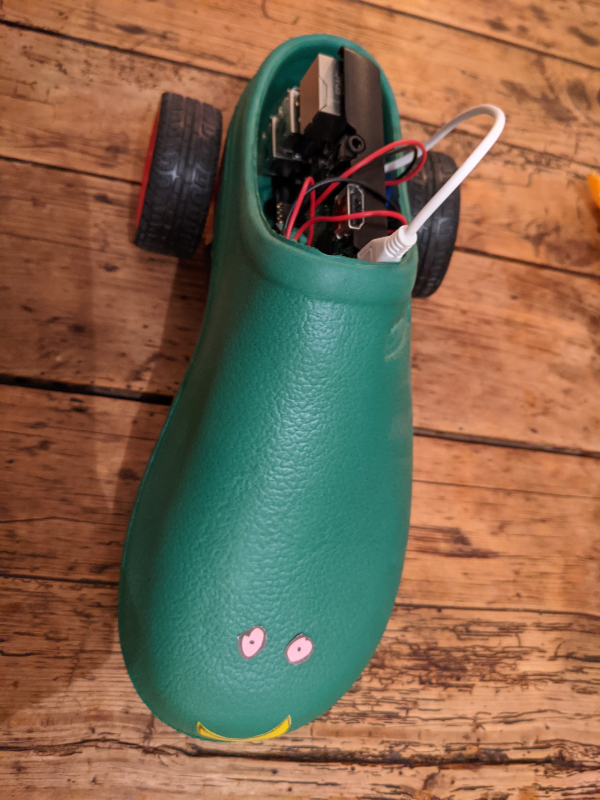

# ShoeBot

##### February 2021

_I refactored this app and implemented more semantic HTML, made a few tweaks to improve the styling and got rid of any unnecessary code (eg. unused ID's)._

##### May 2020

_I made this app in order to control a robot (built out of an old shoe- hence the name!). It can go forwards, backwards, left and right!_

## How it works:

- ShoeBot has two motors (left and right) and runs on a Raspberry Pi
- On the Raspberry Pi there is a Node server running which listens to `POST` requests
- My app communicates with the server over the local network
- The `POST` requests I send contain an array of directions
- When the server receives the request, GPIO pins are used to control the motors which moves ShoeBot

## Main learning points:

- I was able to practice using fetch() again but instead of using a get request like I had for the Kayne West Quote Generator, I used a post request (because I wanted to send data to ShoeBot).
- The user selects the directions by clicking on the relevant image button. This data is then stored in a JavaScript object which is later stringified before being sent to ShoeBot.
- I learnt about JSON.stringify: When sending data to a web server, the data has to be a string. JSON.stringify() converts a JavaScript object into a JSON string. If you wanted to convert data back again after receiving it you would use JSON.parse().
- I used the DOM appendChild to make the users chosen directions show underneath the controls by inserting the arrow image that they clicked on into a div container. This was good practice as I'd not done this much before and I was really pleased with how it worked.

## Built with:

- HTML
- CSS
- JavaScript

## Getting Started:

Clone the repo as instructed below

## Prerequisites:

ShoeBot! Please see Usage below

## Installation

1.  Clone the repo

`git clone https://github.com/katiehawcutt/robot-controller-app.git`

2. Run the index.html in a browser

## Usage

Unfortunately you won't actually be able to play with ShoeBot (as you don't have him!) but if you open up the console in the browser you will be able to see what is happening under the hood. As you click on the arrows you will be plotting his directions which you will see are stored in an array. When you press execute you will notice the fetch request being sent with this data. You can clear the directions at any time and start again by pressing clear.
